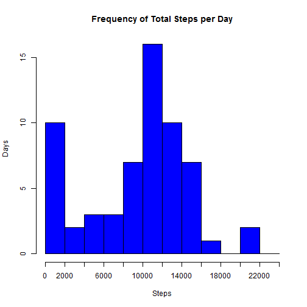
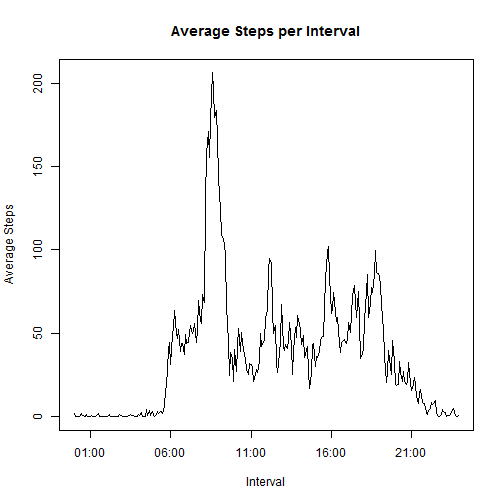
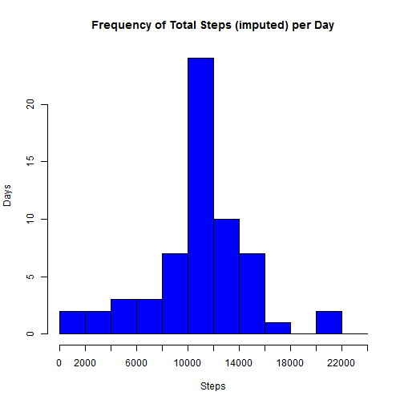
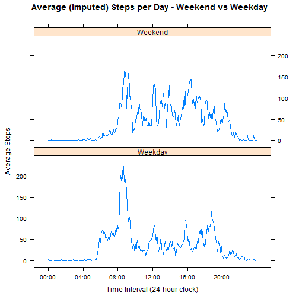

---
output:
  html_document:
    keep_md: yes
---
Peer Assessment 1 for Reproducible Research
===========================================
For this assignment, I will  
1. Read the data set into an appropriate format  
2. Display a histogram of total steps per day, and calculate the mean and median number of steps taken each day.    
3. Make a "time series" plot showing average steps taken during each 5-minute interval, and discuss what this plot shows.  
4. I'm going to discuss the presence of missing values, devise a strategy to keep them from affecting my results, and create a new dataset with the missing value filled in. Then I'll make a new histogram and discuss the difference between this data set and that I used for the analysis in Step 3.  
5. Look for pattern differences in weekends vs weekdays.  
----------------------------------------------------------------------------------

##Step 0: Set global options and establish libraries needed for the project##  

```r
library(lattice)
library(knitr)
opts_chunk$set(echo=TRUE,results="show",cache=TRUE)
setwd('C:/Coursera/Data_Science/Reproducible_Research/RepData_PeerAssessment1')
```

##Step 1: Read in the Data##  

```r
#This is the Master file so I don't have to re-import the data if I mess up the working data frame
dfMaster <- read.table("activity.csv",
               header=TRUE,
               sep=",",
               stringsAsFactors = FALSE,
               colClasses = c("numeric","Date","numeric")
               )
```

```
## Warning in file(file, "rt"): cannot open file 'activity.csv': No such file
## or directory
```

```
## Error in file(file, "rt"): cannot open the connection
```

```r
#df is the data frame I'll be working with. If I mess it up, I can copy the Master without re-importing from file.
df <- dfMaster
```

##Step 2: Make Histogram, do Calculations##  
Now that I have the data imported, we can look at a histogram of total steps per day.  
First, we create a new data frame using aggregate() that totals the steps for each day, then make the histogram.  
After that, we calculate the mean and median steps per day.  
(Since NA values are skipped, days with many NA intervals will show few steps.)   

```r
TotalStepsByDay <- aggregate(df$steps,list(date=df$date),sum,na.rm=TRUE)
xAxisBreakdown = seq(from=0,to=25000,by=2000) 
hist(TotalStepsByDay$x,
      breaks = xAxisBreakdown,
      main="Frequency of Total Steps per Day",
      col="blue",
      xlab="Steps",
      ylab="Days",
      xaxt="n")
axis(side=1,at=xAxisBreakdown,labels=xAxisBreakdown)
```

 

```r
stepMean <- mean(TotalStepsByDay$x,na.rm=T)
stepMedian <- median(TotalStepsByDay$x,na.rm=T)
print(paste("The Mean number of steps per day is",round(stepMean,1)))
```

```
## [1] "The Mean number of steps per day is 9354.2"
```

```r
print(paste("The Median number of steps per day is",round(stepMedian,1)))
```

```
## [1] "The Median number of steps per day is 10395"
```

##Step 3: Time Series Pattern##  
First we need to create a data frame that has the average steps per interval across all days.  
Then can make a time series plot to see average activity rates throughout the day.  

```r
#First we need to convert the 5-minute 24-hour clock intervals into a time class; the next few steps will do that.

#The hours of the interval are equal to the first two digits (interval divided by 100, with remainder tossed)
intHours <- df$interval %/% 100

#Now add a leading 0 when the hours are one digit
intHours <- ifelse(intHours < 10,paste("0",intHours,sep=""),intHours)

#The minutes of the interval are equal to the second two digits (the remainder after dividing by 100)
intMinutes <- df$interval %% 100

#Now add a leading 0 when the minutes are one digit
intMinutes <- ifelse(intMinutes < 10,paste("0",intMinutes,sep=""),intMinutes)

#Now put the minutes and hours together and convert to a time with strptime()
intTime <- paste(intHours,":",intMinutes,sep="")
intTime <- strptime(intTime,format="%H:%M")

#Now add the time variable back into the original data set
df <- cbind(df,intTime)

#We now have the time in the data frame as a time, so we can compute the mean number of steps for each time interval and plot the result
SPI <- aggregate(df$steps,list(intTime=df$intTime),mean,na.rm=TRUE)
plot(SPI$intTime,SPI$x,
     type = "l",
     main = "Average Steps per Interval",
     xlab = "Interval",
     ylab = "Average Steps")
```

 

```r
#Also compute which interval has the highest average
MaxStepAvg <- max(SPI$x)
IntervalWithMaxStepAvg <- SPI$intTime[SPI$x == MaxStepAvg]
```
The highest average occurs at 08:35 and is equal to 206.2.


##Step 4: Handle Missing Values## 
In this step, I'll do the following:  
a. Calculate and report the number of missing values in the dataset.  
b. Create a dataset that replaces NA values with the mean for that interval.  
c. Redo the plot and calcs from Step 2, and discuss the differences in each.  

*Part a*

```r
countNAs <- sum(is.na(df$steps))
```
There are a total of 2304 missing values.

*Part b*

```r
#First, I'll rename column "x" in data frame SPI to what it actually represents
names(SPI)[names(SPI)=="x"] <- "avgIntervalSteps"

#Now merge the average back into the dataframe by intTime
dfWithAvg <- merge(x=df,y=SPI,by="intTime",all.x=TRUE)

#It's not strictly necessary, but I'll reorder the new dataframe to preserve the date,interval ordering of the original file
dfWithAvg <- dfWithAvg[order(dfWithAvg$date,dfWithAvg$intTime),]

#Now create another column that uses the steps, if available, and the avgIntervalSteps otherwise.
dfWithAvg$imputedSteps <- ifelse(is.na(dfWithAvg$steps), 
                                 dfWithAvg$avgIntervalSteps,
                                 dfWithAvg$steps)
```

*Part c*  
I'm copying the code directly from Step 2, then changing df to dfWithAvg and steps to imputedSteps. Other variable names change similarly.  

```r
TotalStepsByDayImputed <- aggregate(dfWithAvg$imputedSteps,list(date=dfWithAvg$date),sum,na.rm=TRUE)
xAxisBreakdown = seq(from=0,to=25000,by=2000) 
hist(TotalStepsByDayImputed$x,
      breaks = xAxisBreakdown,
      main="Frequency of Total Steps (imputed) per Day",
      col="blue",
      xlab="Steps",
      ylab="Days",
      xaxt="n")
axis(side=1,at=xAxisBreakdown,labels=xAxisBreakdown)
```

 

```r
stepMeanImputed <- mean(TotalStepsByDayImputed$x,na.rm=T)
stepMedianImputed <- median(TotalStepsByDayImputed$x,na.rm=T)
print(paste("The Mean number of imputed steps per day is",round(stepMeanImputed,1)))
```

```
## [1] "The Mean number of imputed steps per day is 10766.2"
```

```r
print(paste("The Median number of imputed steps per day is",round(stepMedianImputed,1)))
```

```
## [1] "The Median number of imputed steps per day is 10766.2"
```
The mean and median have changed significantly. The stepsImputed variable has 2304 replaced observations (out of 17568); since they're all replaced with means for intervals, day totals will naturally have a much stronger central tendency. Most of the low-step days in Step 2 were due to NA values in the intervals; those days now are essentially equal to the average for all days.  
This is not a statistically valid way to fill in missing data, but it fulfills the conditions of this assignment.  

##Step 5##
Now I'm going to add the day of the week to the dfWithAvg data frame, create a new variable for Weekend or Weekday, then use aggregate() to summarize the data by it. Then I'll use the lattice plotting system to make comparison plots.  

```r
dfWithAvg$weekday <- weekdays(dfWithAvg$date)
dfWithAvg$weekendFlag <- ifelse(dfWithAvg$weekday=="Saturday" | dfWithAvg$weekday=="Sunday","Weekend","Weekday")

#This line computes the average steps / day for weekend and weekdays
SPI2 <- aggregate(dfWithAvg$imputedSteps,list(intTime=dfWithAvg$intTime,weekendFlag=dfWithAvg$weekendFlag),mean,na.rm=TRUE)

#Before plotting, set up the sequence to appear on the x-axis
#(This is based on StackOverflow post 14243834)
xn <- seq(min(dfWithAvg$intTime),max(dfWithAvg$intTime),by="4 hour")

#Draw the plot with the x-axis in HH:MM format
xyplot(x~intTime|weekendFlag,
       data=SPI2,
       type="l",
       layout=c(1,2),
       xlab = "Time Interval (24-hour clock)",
       ylab = "Average Steps",
       main = "Average (imputed) Steps per Day - Weekend vs Weekday",
       scales=list(
                    x=list(
                            at=xn,
                            labels=format(xn,"%H:%M")
                            )
                  )
        )
```

 

It looks like patterns are different for weekdays and weekends. On weekdays, there's a large burst of activity just after 8am, but a smaller burst on weekends. Overall, weekends show more regular activity throughout the day than on weekdays where most activity occurs in the mornings, just after noon, and in the evenings.


##Credits##  
This project would not have been possible without the following resources:  
1. StackOverflow.com, for aggregate(), merge(), ifelse(), and help with dates.  
2. The course's discussion forums, primarily for understanding how the interval column was defined, correcting some initial errors in what displays were actually wanted, and submitting the files in accordance with the directions.  
3. Other sites such as statmethods.net and r-bloggers.com for sorting a data frame, renaming a column, and other particulars.  

**Note:** *While this work would not have been possible (without a great deal of additional effort, at least) without the above references, the resulting code is solely my work. No portion has been copied verbatim from any source.*
